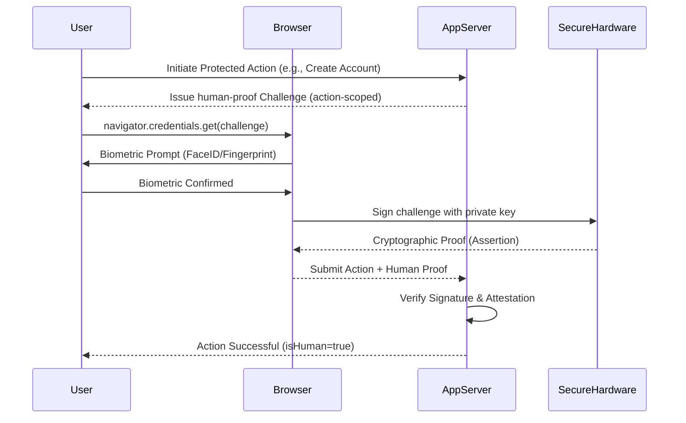

# Architecture Overview: The Human-Proof Protocol

Human-Proof is a challenge-response protocol built on top of the **WebAuthn (FIDO2)** standard, specifically optimized for **synchronous human-presence verification** rather than asynchronous identity authentication.

## 🧱 Key Components

### 1. The Prover (Client-Side SDK)
- Communicates with the browser's `navigator.credentials` API.
- Generates action-bound public keys from the device's Secure Enclave.
- Signs server-issued challenges scoped to a specific activity (e.g. `vote:42`).

### 2. The Verifier (Server-Side Logic)
- **Challenge Manager**: Issues short-lived (60s), single-use random challenges.
- **Attestation Processor**: Analyzes the hardware attestation format (Apple, Android, TPM) to classify the device into a Trust Tier.
- **Crypto Engine**: Verifies SHA-256/ECDSA signatures against the stored human-key.

### 3. The Pluggable Store
- Standardized via the `IHumanStore` interface.
- Stores `credentialId -> publicKey` mappings and sign counts.
- Designed to be easily implemented for Redis, SQL, or NoSQL databases.

## 🔄 Protocol Flow

## 🔐 Trust Classification
human-proof does not treat all devices equally. The architecture allows for tier-based policies:

- **Tier 1 (High)**: Biometric-unlocked secure enclaves (iPhone, Android StrongBox). Effectively prevents software-only automation.
- **Tier 2 (Standard)**: TPM-backed modules or FIDO2 Security Keys.
- **Tier 3 (Low)**: Unknown or virtualized authenticators (e.g., emulators).
